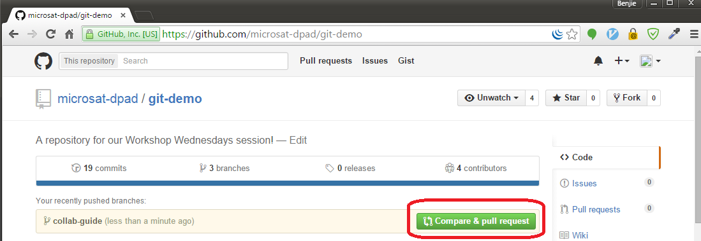

# This is a repository for our Workshop Wednesday session!

# Collaboration Guide

## Step 1: Create a new branch from master
```
# Make sure you have the latest copy of master
git checkout master
git pull origin master

# Create feature branch
git checkout -b yourbranchname
```

## Step 2: Save all changes to your feature branch
```
# Make sure that you are in the right branch
git checkout yourbranchname

# Commit and push changes to feature branch
git add .
git commit
git push -u origin yourbranchname
```

## Step 3: When done, prepare your feature branch for merging

```
# Make sure that you are in the right branch
git checkout yourbranchname

# Update local copy of master
git pull origin master

# Rebase recent changes from master into your feature branch
git rebase master

# [Resolve possible conflicts in your code]

# Commit final changes on feature branch
git add .
git commit
git push -u origin yourbranchname
```

## Step 4: Go to GitHub and submit a merge request
